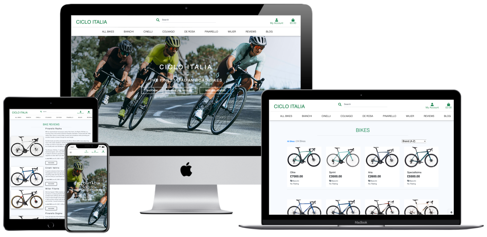

<h1 align=center id=top> Ciclo Italia </h2>

Ciclo Italia is an online bike store offering a selection of the finest Italian designed road racing bikes!

<h2 align=center id="top"></h2>

View live project [here](https://ciclo-italia.herokuapp.com/) 

# Table of Contents

**<details><summary>[User Experience (UX)](#user-experience-ux)</summary>**

- [User Stories](#user-stories)
- [Strategy](#strategy)
- [Scope](#scope)
  - [Existing Features](#existing-features)
  - [Future Features to Implement](#future-features-to-implement)
- [Structure](#structure)
- [Database](#database)
- [Data Schema](#data-schema)
- [Skeleton](#skeleton)
- [Wireframes](#wireframes)
- [Surface](#surface)
  - [Colours](#colours)
  - [Typography](#typography)
  - [Animations](#animations)

  </details>

**<details><summary>[Technologies Used](#technologies-used)</summary>**

- [Languages](#languages)
- [Integration](#integration)
- [Dependencies](#dependencies)
- [Tools](#tools)
- [IDE Extensions](#ide-extensions)
- [Code Validity](#code-validity)

</details>

**<details><summary>[Bugs/Issues](#bugs)</summary>**

- [Project barriers and solutions](#project-barriers-and-solutions)
- [Known Issues](#known-issues)

</details>

**<details><summary>[Workflow](#workflow)</summary>**

- [Version Control](#version-control)
- [Development Environment](#development-environment)

</details>

**<details><summary>[Deployment](#deployment)</summary>**
</details>

**<details><summary>[Testing](#testing)</summary>**
</details>

**<details><summary>[Credits](#credits)</summary>**

- [Resources](#resources)
- [Media](#media)
- [Content](#content)
- [Code Snippets](#code-snippets)
- [Acknowledgments](#acknowledgments)

</details>

**<details><summary>[Support](#support)</summary>**
</details>

---

## User Experience (UX)

### User Stories


### Strategy

The target demographic encompasses riders from 18 upwards who have the desire and finanacil freedom to own a beautiful and finely crafted Italian road bike 

This demographic will include riders of all abilities, from weekend leisure riders, to daily commuters, to serious amateur road racers, semi-professional riders and fully professional team riders

Riders purchasing from the site for competitive reasons will most likely be competing in road racing, time trialling, triathlon and cyclocross events

The site attempts to provide to its users an attractive, user friendly experience and functionality, which allows customers to easily find the bike of their dreams at an affordable price

Ciclo Italia provides a high quality selection of Italian designed road bikes providing customers with high quality imagery, detailed descriptions, customer reviews and competitive pricing, to allow informed decisions before purchases are completed

The main strategy of this site to provide accurate information about the products offered, make it easy and intuitive to navigate and transparent with information to maintain trust and integrity with users

#### Project Goals

To provide customers with a comprehensive, attractive and user friendly site that showcases a selection of the best Italian designed road racing bikes

#### User Goals

Users can easily find their desired bike, see transparent pricing, read reviews on each bike, and choose whether to complete a purchase

### Scope

Project reflects my current skill-set of HTML, CSS, JavaScript, Python and Django

To provide an app with relevant categories, product listings and detail pages, with scope for future expansion

#### Existing Feature

- Fully responsive website for all common mobile, tablet and desktop devices, using Bootstrap responsive grid and custom media queries
- Striking home page jumbotron image to convey a positive initial response from visitors
- Intuitive and responsive Navigation menu with links and search facility
- Links to all available bikes, each available brand and each available model containing a description and image
- A filtering function to sort available bikes
- Registration page with form
- Login page with form
- Profile page containing personal details, payment details and order history
- Cart page with form displaying chosen bike/s
- Checkout page with payment functionality
- Reviews page containing customer reviews of bikes
- Blog page containing cycling themed blog posts
- Project management page for adding, updating and deleting bikes
- Blog and review add/edit page for adding, updating and deleting blog and review entries
- Footer element with social media icon links

#### Future Features to Implement

- Membership scheme app to save on future purchases 
- Members forum app for sharing cycling information such as routes, holidays, maintenance tips, bike recommendations etc
- Contact app to enable users to contact the site owners to ask questions, give feedback etc

### Structure

The overall structure is aimed at ease of navigation to each section and an intuitive path from initial arrival on the home page through finding the desired bike through to a smooth and secure final payment checkout experience

#### Interaction Design

The content has been laid out in an intuiitive way, providing a good flow of information. The home page clearly leads to the bikes page where customers can easily browse through all available bikes. Purchases can be easily made from the bikes page through an easy to use cart and checkout payment pages 

Clear feedback is provided to the user after each interaction, using the messages function in Django and with the use of javascript pop-up toast messages

#### Information Architecture

TBA =========> navigational SCHEMA.   

The main organising principle for the user is the brand. The app contains a total of 6 brands. Each brand contains 4 bike models. This gives the current app a total of 24 bikes available to view

Available bikes can be found by searching by the following methods:

- Search by brand
- Search by bike model name
- Search by keyword

#### Database

Development - SQLite3
Production - Heroku Postgres

### Skeleton

#### Page Structure


#### Wireframes

[MOBILE WIREFRAMES](docs/wireframes/)
[TABLET WIREFRAMES](docs/wireframes/)
[DESKTOP WIREFRAMES](docs/wireframes/)

The layout has been kept consistent throughout the site with the navigation bar and footer consistemt to all pages

- Top Navigation bar containing the following before a user is logged in:
  - Ciclo Italia brand logo, providing a site wide link back to the home page
  - A search bar providing users with a way to search by keyword
  - My Account link icon with dropdown menu providing links to the register page and login page
  - Shopping Bag link icon providing access to users shopping cart
- Top Navigation bar containing the following when a user is logged in:
  - Ciclo Italia brand logo, providing a site wide link back to the home page
  - A search bar providing users with a way to search by keyword
  - My Account link icon with dropdown menu providing links to Product Management for superusers, Add/Edit Bike Reviews, Add/Edit Cycling Blog Post, My Profile and Logout for all users
  - Shopping Bag link icon providing access for all users to their shopping cart

- Bikes navigation links situated below the search bar:
  - All Bikes 
    - link that displays all available bikes
  - Bianchi   
    - link to all available Bianchi bikes, including dropdown menu with links to each individual Bianchi model
  - Cinellii  
    - link to all available Cinelli bikes, including dropdown menu with links to each individual Cinelli model
  - Colnago   
    - link to all available Colnago bikes, including dropdown menu with links to each individual Colnago model
  - De Rosa   
    - link to all available De Rosa bikes, including dropdown menu with links to each individual De Rosa model
  - Pinarello   
    - link to all available Pinarello bikes, including dropdown menu with links to each individual Pinarello model
  - Wilier   
    - link to all available Wilier bikes, including dropdown menu with links to each individual Wilier model
  - Reviews 
    - link that displays all existing bike review posts
  - Blog 
    - link that displays all existing cycling blog posts
  
- Footer with social media links to Facebook, Twitter, Instagram, YouTube and Pinterest

  ### Surface

The overall UX aligns with the design priciples of a modern online bike store type site. The overall feel needs to give confidence to customers that they are purchasing from a professional organisation 

#### Colours
  
Colour palette has been chosen to reflect the Italian origins of the bikes that are available for customers to purchase

Colour Palette generated on [Coolors.co](https://coolors.co/)

. This font was chosen as it has a modern, technical feel that reflects the high level of technical expertise that goes into designing and manufacturing the best Italian bikes

#### Images

High quality imagery is vital to convey the beauty of the products to potential customers. High quality images of each bike allow customers to fully appreciate what they will be buying and allows them to make an informed decision before completing a purchase

README icons are hosted on [Cloudinary](https://cloudinary.com/), a cloud-based service that provides an end-to-end image and video management solution

> [Back to Top](#table-of-contents)  

## Technologies Used

Designed with HTML5, CSS3, JavaScript, Python3 with the Django Framework

### Languages

 [HTML5](https://en.wikipedia.org/wiki/HTML5)

 [CSS3](https://en.wikipedia.org/wiki/Cascading_Style_Sheets)

 [JavaScript](https://en.wikipedia.org/wiki/JavaScript)

 [Python](https://en.wikipedia.org/wiki/Python_(programming_language))

### Integration

 [Bootstrap](https://getbootstrap.com/) - by linking via [Bootstrap CDN](https://www.bootstrapcdn.com/) to HTML Doc

 [FontAwesome](https://fontawesome.com/) Icons for Social Media links

 [Google Fonts](https://fonts.google.com/) - Overall Typography import

 [jQuery](https://jquery.com/) - JavaScript library

 [Django](----------------------) Micro web framework written in Python

### Tools

 [VSCode](https://code.visualstudio.com/) - Main workspace IDE (Integrated Development Environment)

 [Git](https://git-scm.com/) - Distributed Version Control tool to store versions of files and track changes

 [GitHub](https://github.com/) - A cloud-based hosting service to manage Git repositories

 [Heroku](https://heroku.com) - Container-based cloud platform for deployment and running of apps

 [AWS S3](https://aws.amazon.com/s3/) - Cloud storage for static and media files

### IDE Extensions

- Auto Close Tag
- Beautify - Code Formatter
- Indent-Rainbow
- Bootstrap 4 CDN Snippet
- Markdown Lint
- Python
- JSHint

### Code Validity

- HTML - [W3C](https://validator.w3.org/) - Markup Validation
- CSS - [W3C](https://jigsaw.w3.org/css-validator/) - Jigsaw CSS Validation
- JavaScript - [JSHINT](https://jshint.com/) - JavaScript code warning & error check
- Python - [Pyton Tester](https://extendsclass.com/python-tester.html) Python code syntax checker
- [Autoprefixer](https://autoprefixer.github.io/) Parses CSS and adds vendor prefixes
- [Google Mobile-Friendly Test](https://search.google.com/test/mobile-friendly) Mobile-friendly check on site
- [Website Page Test](https://www.webpagetest.org/) Runs a website speed test from multiple locations around the globe using real browsers (IE and Chrome) and at real consumer connection speeds.
- [Online-Spellcheck](https://www.online-spellcheck.com/) Online spelling and grammar checks for site and README content

### Other

- [Favicon](https://favicon.io/favicon-converter/) - Favicon Generator
- [Affinity Photo](https://affinity.serif.com/en-gb/photo/) - Image manipulation and colour corrections
- [PDF Tools](https://tools.pdf24.org/en/) for wireframe PDF compression

> [Back to Top](#table-of-contents) 

## Bugs

  - When creating new bike reviews and cycling blogs from within the app admin all details render correctly. However, when creating from within the app itself, titles, text, added by and published time details all render correctly but images do not render correctly. I will endevour to solve this issue in the near future.

### Project barriers and solutions

  - I encountered problems in enabling webhooks to perform as required. I found that purchase confirmation emails were not being sent due to webhook errors.

> [Back to Top](#table-of-contents) 

## Workflow

### Version Control

- Used Git for version control

### Development Environment

- All code was written on [Visual Studio Code](https://code.visualstudio.com/), within the Github environment
- The code was then pushed to GitHub where it is stored in my [Repository](https://github.com/sruss07/MS04-Ciclo-Italia)

> [Back to Top](#table-of-contents) 

## Deployment

### Local Installation

#### 1. Cloning the project

- The code can be run locally through clone or download from the repository on [GitHub](https://github.com/sruss07/MS04-Ciclo-Italia).
- You can do this by opening the repository, clicking on the Code' button and selecting either 'clone or download'

    
- The Clone option provides a URL, which you can use on your CLI with `git clone <paste url>`.
- The Download ZIP option provides a link to download a ZIP file which can be unzipped on your local machine. The files can then be uploaded to your IDE

#### 2. Create a Virtual Environment

In the Terminal window:

- Navigate to the folder of the installed files with `cd <path>`
- Create the virtual environment folder with `python -m venv venv`
- Activate the virtual environment with `venv\Scripts\activate.bat

#### 3. Create Environmental Variables

TBA =========

#### 4. Create a .gitignore file

- Create a file called **.gitignore** in the root directory and ensure it contains the following git exclusions:

```text
    core.Microsoft*
    core.mongo*
    core.python*
    env.py
    __pycache__/
    *.py[cod]
    venv
    .vscode
    *.sqlite3
    *.pyc
```

#### 5. Install project dependencies

- Install project requirements by typing `pip install -r requirements.txt`

#### 6. Deploy locally

- To run the project locally, in the terminal type `python manage.py runserver`
- This will open a localhost address, which is provided in the CLI.
- Either copy and paste the url shown below into a new browser tab, or hover over it and click *follow link*

#### 7. Remote Deployment on Heroku

 [Back to Top](#table-of-contents) 

 ## Testing

TBA =========> Testing documentation can be found on a separate document [HERE](static/testing/TESTING.md)

## Credits

### Resources

- [Code Institute Course Content](https://courses.codeinstitute.net/) - Main source of knowledge
- Code Institute **SLACK Community** - Main source of assistance
- [Stack Overflow](https://stackoverflow.com/) - General resource
- [Youtube](https://www.youtube.com/) - General resource
- [CSS-Tricks](https://css-tricks.com/) - General resource
- [W3.CSS](https://www.w3schools.com/w3css/4/w3.css) - General resource
- [CommonMark](https://commonmark.org/help/) - Markdown language reference
- [Colour Palette - Coolors.co](https://coolors.co)
- [TinyPNG](https://tinypng.com/) - Compression of images for site
- [Am I Responsive](http://ami.responsivedesign.is/) - Responsive website mockup image generator
- [Balsamiq](https://balsamiq.com/wireframes/) - Wireframing design tool

### Media

- Site images used are from .
- Icons used in the Technologies Used section of this document are taken from various sources (mainly Wikipeadia).

### Content

All content is self-written by site creator.

### Code Snippet


## Acknowledgments

I would like to thank:

- My mentor, **Gerard McBride** for his guidance and advice
- Everyone in Tutor support for always being patient and friendly when approaching with assistance during course material
- **CI staff** and **Slack Community** for always being on-hand with questions posted and assistance requests

> [Back to Top](#table-of-contents) 

