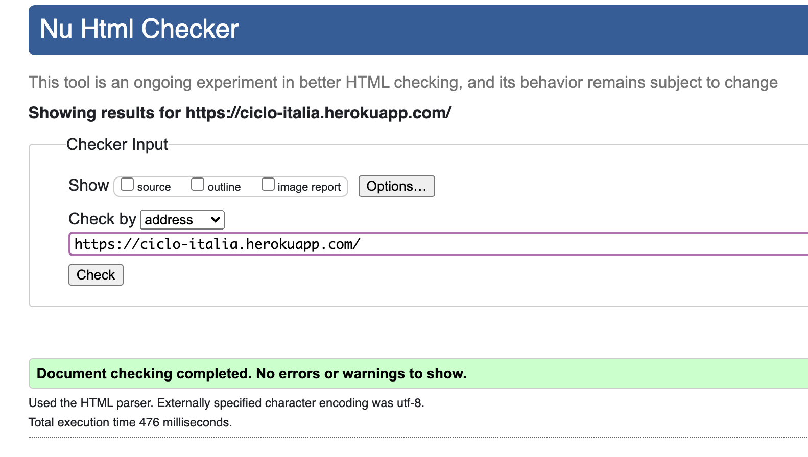
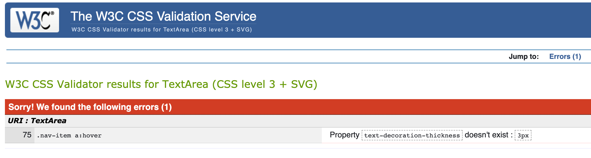
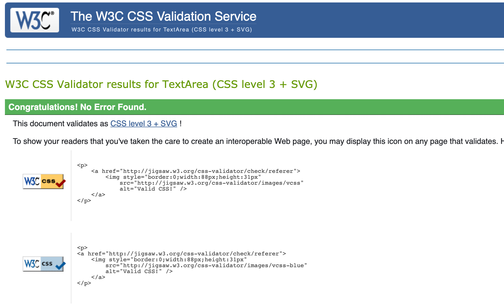
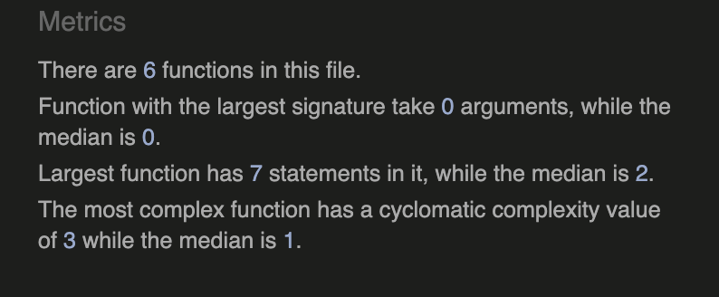
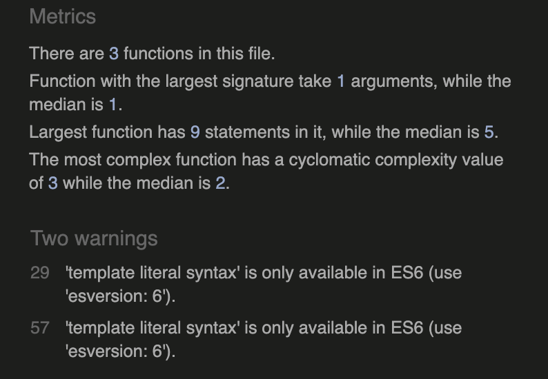
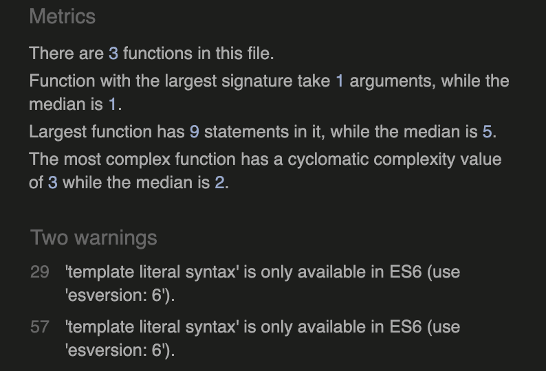

**Table of Contents**

1. [Code Testing](#code-testing)
  - [Automated Testing](#automated-testing)
  - [Validator Testing](#validator-testing)
2. [User Story Testing](#user-story-testing)
3. [Manual Testing](#manual-testing)
  - [Lighthouse](#lighthouse)
  - [Responsive Testing](#responsive-testing)
4. [Usability Testing](#usability-testing)
5. [Defensive Design](#defensive-design)
  - [Navbar](#navbar)
  - [Footer](#footer)
  - [Login/Signup](#login/signup)
  - [Products](#products)
  - [Checkout](#checkout)
  - [Blog](#blog)
 
Back to [README.md](https://github.com/sruss07/MS04-Ciclo-Italia/blob/master/README.md)

# Code Testing

## Automated Testing

In addition to the full manual testing, I created a few automated tests. 
The automated testing can be improved as I am not 100% confident with automated testing.

11 automated tests were created and run. These include:
- Checkout>tests.py: Order form testing
- Bikes>tests.py: Bike form testing and Bikes page view test

- In the terminal type the following command:
  `python manage.py test <<app name>>`
- The test results will be shown within the terminal.

## Validator Testing 

[W3C Markup Validation](https://validator.w3.org/nu/#textarea)

### HTML 

### Entire app html

- No errors were returned

### CSS

### base.css

- 1 error was returned 
    - This error relates to the underline effect when clicking on navbar links and dropdown menu links. The error states that the 'property text-decoration-thickness doesn't exist'. I have chosen to ignore this errror as the css is causing no problems with running the app and the css provides the desired underline effect that was intended

### checkout.css

- No errors were returned

### profile.css

- No errors were returned

 [JSHINT](https://jshint.com/)

 - When run through the [JSHint validator](https://jshint.com/) these metrics were returned:
 
### main.js

### countryfield.js

### stripe.js

 
 # User Story Testing

## As a site user, I want to be able to:
- Easily register for an account, so that I can be able to have a personal account and be able to view my profile
    - User is able to easily register an account, confirm registration via the email sent and view their profile with their details saved. 
    - To test this, I used [Temp Mail](https://temp-mail.org/en/view/d6f8aafbb803f106352d2bd9cdf115f7) to generate a temporary email address to register with. 
    - You can see below, upon registration, the user will receive an email and a prompt to follow the link to confirm:
    - 
- Easily login and logout, so that I can access my personal account and easily logout to quit the session
    - User is able to quickly logout of their profile via the 'Logout' button in the navbar
- Have a personalised user account so that I can view my personal order history and order confirmations, and save my payment information
    - User is able to easily navigate to the 'Profile' page where they can update their information
- Easily navigate to the blog so that I can read the latest blog posts
    - User can follow the prompt on the home page, the link in the nav bar or the link to the blog after checkout success to get to the blog list
- See short descriptions of each blog, so that I can quickly decide which blog post I would like to read
    - User is able to see the blog text in the blog list 
- Easily navigate to the blog post details so that I can read the full blog post to learn new information about jewellery
    - User can follow the 'Read More' button to see the full blog post 
- Easily leave comments, pending approval by the site owner so that I can express my thoughts on the blog post 
    - User can easily leave comments, with their name and comment text 

## As a site owner, I want to be able to:
- Easily add new products to sell, so that I can keep my store reflecting new products in my inventory
    - Site owner can navigate to the 'Product Management' page in the header, use the form to add an image, if site owner does not include an image, the 'no-image' image will show
- Easily edit/update existing products that are listed, so that I can keep my products listing up to date with the correct information 
    - Site owner can navigate to the edit profuct feature via the product details. Site owners can update the product accordingly. 
- Quickly delete products should they no longer be available to the shopper, so that I can make sure the shopper does not select a product that is no longer available 
    - Site owners can esily delete the product by following the 'Delete' button in the product details page
- Easily create new blog post, edit existing blog posts and delete blog posts, so that I can keep my blog up to date with new posts and delete post that may no longer be relevant
    - Site owner can navigate to the 'Add a blog post' page in the header, use the form to add an image, if site owner does not include an image, the 'no-image' image will show
    - Site owners can edit their blog posts accordingly
    - Upon testing, the deete function was not working and a 'Not Found' error was returned. This was due to a small error in the delete post url. It is now fixed, the site owner is able to delete a blog post.
    - The site owner will be redirected to the Blog list page once they delete a post 

## As a shopper, I want to be able to:
- Sort the list of available products so that I can easily identify the best rated, best priced and categorically sorted products
    - User is able to navigate to the 'All products' page, where they can use the sort by feature to sort the products by price, rating, name or category. 
- Sort a specific category of product so that I can find the best rated or best priced product within a specific category
    - User can navigate to a more specific category of product and sort by feature to sort the products by price, rating, name or category
- Sort multiple categories of products simultaneously so that I can find the best rated or best priced product within a specific category such as 'rings' or 'necklaces'
    - User can choose the 'All Earrings', 'All Necklaces', or 'All Rings & Peircings' buttons in the top nav bar to sort by multiple categories
- Sort for a product by name, description so that I can find a specific product with known keywords
    - User can use the top search function to sort products by keywords they searched for 
- Easily see what I have searched for so that I can quickly see if the product I have searched for is available
    - User will be able to see the keyword they searched for
- Easily select the quantity of a product when purchasing it so that I can ensure I dont select the wrong product, or quantity
    - User can use the quantity increment or decrement buttons to change the quantity of the products to add to Shopping bag 
- Adjust the quantity of items I would like to buy, so that I can make sure that I am buying the desired amount
    - Users can adjust the number of a specific product with the quantity increment or decrement buttons
    - User can then either update or remove the items from their Shopping bag 
- Easily see the subtotal for each item, so that I can get an idea of how much I am spending on each item
    - The subtotal is available to the user in the shopping bag for each product 
- Safely and securely use my card details to make the payment, so that I can have peace of mind that the payment is safe
    - User can use their card details to make secure payments with Stripe
- Save my details on the site, so that I can be a return shopper without the hassle of re-entering all of my details 
    - The user can easily save their details with the 'Update Profile' button 
- View an order confirmation after Checkout
    - User will be directed to a 'Checkout Successful' page where they will be able to see the order details 
    - The user will also be sent an email with the order confirmation and order details to the email address they signed up with
- Receive an email confirmation after checkout, so that I can keep the confirmation of what I have purchased in my records
    - The user will be sent an email with the order confirmation and order details to the email address they signed up with 
    - Below you will see confirmation of order that the user receives upon placing an order:
    - 

:arrow_up: [Back to top](#code-testing)

# Manual Testing

## Lighthouse 

- An audit was completed using Lighthouse on the Rivercity jewellery. 
- Quite a low performance but upon completing audits of several other websites, such as: 
    - [Code Like a Girl](https://code.likeagirl.io/) 
    - [Medium](https://medium.com/) 

I learned that higher markings in Accessibility, Best Practices & SEO were more frequent than having a high-performance rating.

## Responsive testing

### Desktop Testing

| Page          | Responsive    | Notes |
| :------------- |:-------------:| :---------------:|
| Index     | Y    | Fully Responsive. No horizontal scrollbar.  |
| Products      |    Y   | Fully Responsive. No horizontal scrollbar.   |
| Product Details |    Y   |  Fully Responsive. No horizontal scrollbar. The Image is rather large   |
| Shopping Bag |   Y   | Fully Responsive. No horizontal scrollbar. Easy to read   |
| Checkout |    Y  | Fully Responsive. No horizontal scrollbar.     |
| Checkout Successful |    Y   |   Fully Responsive. No horizontal scrollbar. Checkout success message is helpful |
| Blog |   Y  | Fully Responsive. No horizontal scrollbar. Blog posts are easily distinguisable    |
| Blog Details|   Y   | Fully Responsive. No horizontal scrollbar. Easy to read commet secton    |
| Sign Up |   Y    |   Fully Responsive. No horizontal scrollbar. Footer is not fixed to bottom  |
| Login |    Y   |   Fully Responsive. No horizontal scrollbar. Footer isn't fixed to bottom  |

### Tablet Testing

| Page          | Responsive    | Notes |
| ------------- |:-------------:| :-----:|
| Index      | Y | Fully responsive, no horizontal scrollbar  |
| Products      |   Y    |  Fully responsive, no horizontal scrollbar. 2 products per row work well  |
| Product Details |  Y     |   Fully responsive, no horizontal scrollbar. Product details easy to read  |
| Shopping Bag |   Y   |   Fully responsive, no horizontal scrollbar   |
| Checkout |    Y  |   Fully responsive, no horizontal scrollbar   |
| Checkout Successful |  Y     |  Fully responsive, no horizontal scrollbar   |
| Blog |  Y   |   Fully responsive, no horizontal scrollbar. Blog post easy to read  |
| Blog Details|  Y    |   Fully responsive, no horizontal scrollbar. Comment section easy to read  |
| Sign Up |  Y     |   Fully responsive, no horizontal scrollbar   |
| Login |  Y     |   Fully responsive, no horizontal scrollbar   |

### Mobile testing

| Page          | Responsive    | Notes |
| :-------------: |:-------------:| :-----:|
| Index      | Y| Fully Responsive, footer looks nice |
| Products      |   Y    |  Fully responsive there is noticable whitespace above header. Images better size |
| Product Details |  Y     |   Fully responsive, added product to bad, success message works well  |
| Shopping Bag |    Y  |   Fully responsive with totals at the top of the page for easy reading  |
| Checkout |   Y   |  Fully responsive, order summary and checkout form works well. Country easy to select on iPhone. Card details easy to enter with number pad on iPhone   |
| Checkout Successful |   Y    | Fully responsive,  success message easily read. Buttons to blog responsive |
| Blog |   Y  |   Fully responsive, easy to see which post I would like to read  |
| Blog Details|    Y  |  Fully responsive, article read, image a good size, comment section responsive   |
| Sign Up |   Y    |  Fully responsive , no horizontal scrollbar   |
| Login |    Y   |  Fully responsive, no horizontal scrollbar   |

# Usability Testing
- A site-wide usability test was conducted. I asked my partner to help participate in the testing. The user was presented with the following aims:
    - You are an avid jewellery enthusiast. You are interested in buying yourself a new piece of jewellery at a treat, you deserve it!
    - Navigate to the Home page to see if you would prefer to go stright to the product or check out the blog.
    - You decide that you would like to know more about jewellery, so you head to the blog. You browse through the blog list and pick a post to read in full.
    - You decide you would like to set up your own profile page, enter your details for convenience. You register with your email and confirm your registration by following the link sent to you via email. 
    - You know would like to buy a pair of earrings. You navigate to the 'Earrings' button and decide to check out 'All Earrings'
    - You have great taste so you decide to buy a pair of the Skew Silver Hoops. 
    - Now you add the earrings to your bag and head to checkout 
    - You should now be able to easily enter your shipping details, card details and complete the order. 
    - The payment went through, you can now review your order on the site and in the email that was sent to your email address, your item is on the way! 
    - You can now see a breakdown of your Rivercity jewellery purchases on your profile page! 

- User Testing Feedback
    - I was able to easily checkout a product, received the email and had a read through the blog. 
    - More work on the buttons for each page would be nice, making all product images the same size would be good as well

# Defensive Design

## Navbar
- All links were tested & deemed to be fully functional, directing users to the desired location.
- Logo redirects the user to the index page

## Footer
- Icons navigate to relevant external links when clicked & a new tab is opened for navigating to this page.

## Login/Signup
- Links in these pages functioned correctly
- Buttons performed desired actions.
- Required fields in forms rendered an error when not filled correctly.
- Messages displayed if the information was submitted incorrectly.

## Products
- All links to other pages were checked & deemed rendering correctly.
- Buttons performed the desired actions.
- Any forms that needed to be filled out flashed relevant errors if filled incorrectly.
- Error messages flashed as desired when forms or pages were submitted incorrectly.

## Checkout
- All links to other pages were checked & deemed rendering correctly.
- Any forms that needed to be filled out flashed relevant errors if filled incorrectly.
- Error messages flashed as desired when forms or pages were submitted incorrectly.

## Blog
- All links to other pages were checked & deemed rendering correctly.
- Any forms that needed to be filled out flashed relevant errors if filled incorrectly. 

[Back to top](#code-testing)

Back to [README.md](https://github.com/lucyrush/rivercity_jewellery#table-of-contents)