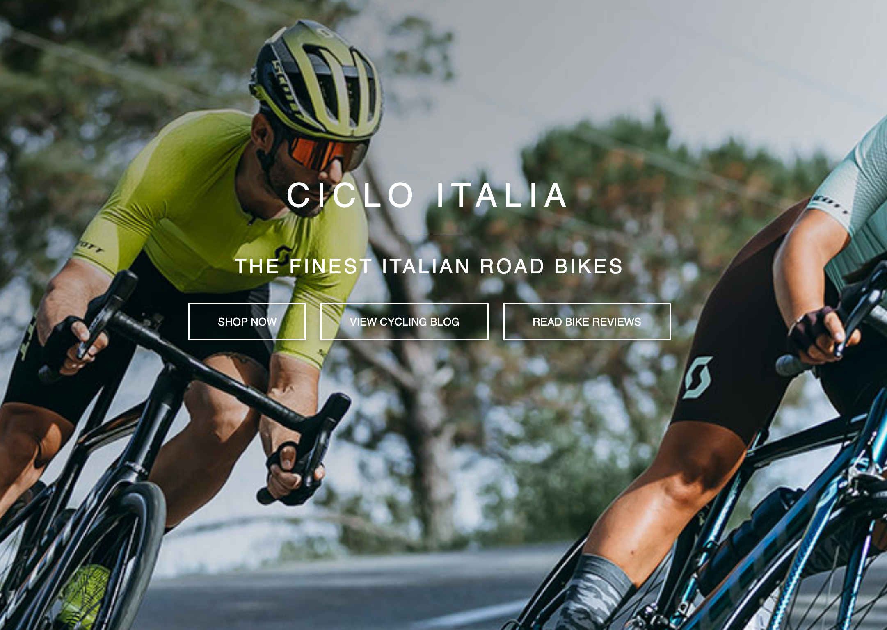

# Table of Contents

1. [Code Testing](#code-testing)
  - [Automated Testing](#automated-testing)
  - [Validator Testing](#validator-testing)
2. [User Story Testing](#user-story-testing)
3. [Manual Testing](#manual-testing)
  - [Responsive Testing](#responsive-testing)
4. [Usability Testing](#usability-testing)
5. [Defensive Design](#defensive-design)
  - [Navbar](#navbar)
  - [Footer](#footer)
  - [Login/Signup](#login/signup)
  - [Bikes](#bikes)
  - [Checkout](#checkout)
  - [Blog](#blog)
  - [Reviews](#reviews)
 
Back to [README.md](https://github.com/sruss07/MS04-Ciclo-Italia/blob/master/README.md)

# Code Testing

## Automated Testing

In addition to the full manual testing, I created a few automated tests. 
The automated testing can be improved as I am not 100% confident with automated testing.

11 automated tests were created and run. These include:
- Checkout>tests.py: Order form testing
- Bikes>tests.py: Bike form testing and Bikes page view test

- In the terminal type the following command:
  `python manage.py test <<app name>>`
- The test results will be shown within the terminal.

## Validator Testing 

[W3C Markup Validation](https://validator.w3.org/nu/#textarea)

### HTML 

### Entire app html

- No errors were returned

### CSS

### base.css

- 1 error was returned 
    - This error relates to the underline effect when clicking on navbar links and dropdown menu links. The error states that the 'property text-decoration-thickness doesn't exist'. I have chosen to ignore this errror as the css is causing no problems with running the app and the css provides the desired underline effect that was intended

### checkout.css

- No errors were returned

### profile.css

- No errors were returned

 [JSHINT](https://jshint.com/)

 - When run through the [JSHint validator](https://jshint.com/) these metrics were returned:
 
### main.js

### countryfield.js

### stripe.js

[Back to Top](#table-of-contents) 
 
 # User Story Testing

## As an Anonymous User I want the ability to...

- Easily navigate the site
    - User is able to easily navigate the site dur to the clear layout of links and information, both before logging in and after logging in, allowing users to find what they are looking for quickly
- View the site on all screen sizes
    - User is able to view the site satisfactorily on all available devices from desktops to laptops, from tablets to mobiles with all links and information rendered as needed for a n excellent user experience
- Search for and view bikes
    - User is able to seamlessly search for and view all bikes available on the site, including bike descriptions, images and prices
- Filter my search results
    - User is able to use the search facility to find bike brands and models by entering brand name, bike model name or keyword
- Read details about each bike
    - User is able to read details on each available bike when the appropriate bike image is clicked on the bikes page, helping them make an informed choice
- Access Ciclo Italia social media links
    - User is able to navigate to the site footer where they can access social media links for Facebook, Twitter, Instagram, YouTube and Pinterest
- Register for a user profile account with a username and password
    - User is able to easily register an account, confirm registration via the email sent and view their profile with their details saved 
    - To test this, I used [Temp Mail](https://temp-mail.org/en/) to generate a temporary email address to register with
- Verify that my registration was successful
    - User quickly receives an email to inform them that their registration has been completed successfully

## As a Registered User I want the ability to...

- Log in and log out of my profile account
    - User is able to easily log in and log out of the site with the login and logout links
- Update my shipping, billing and payment details
    - User is able to login to their profile and easily update their shipping, billing and payment details
- Store my address for later use
    - User details are easily stored by clicking save my details when completeing a purchase
- Store my purchase history
    - User is able to easily browse their purchase and payment history within their personal profile
- Review my purchase choices at checkout
    - User can review and edit their intended purchase within their shopping cart before making the final decision to buy and proceed to the payment page
- Easily make secure payments 
    - User is able to use the site checkout to safely and securely complete payments and feel confident that their details are protected
- Receive email confirmation of my purchase payment
    - User receives a confirmation email to their inbox upon completion of the purchase checkout procedure
- Create personal bike reviews
    - User is able to create their own bike reviews by clicking on the Add/Edit Bike Review link within the My Account dropdown menu
- Update their personal bike reviews entries
    - User is able to edit their own bike reviews by clicking on the Add/Edit Bike Review link within the My Account dropdown menu
- Delete their personal bike reviews entries
    - User is able to delete their own bike reviews by clicking on the Add/Edit Bike Review link within the My Account dropdown menu

## As a Site Admin/Superuser I want the ability to...

- Add new bike listings
    - Site admin/superuser is able to easily create new bike listings by using the product management link located within the my account dropdown menu
- Update existing bike listings
    - Site admin/superuser is able to easily update existing bike listings when information changes by using the product management link located within the my account dropdown menu
- Delete existing bike listings
    - Site admin/superuser is able to easily delete existing bike listings when certain bikes are no longer available by using the product management link located within the my account dropdown menu
- Create cycling blogs
    - Site admin/superuser is able to easily create new cycling blogs by using the add/edit cycling blog link located within the my account dropdown menu
- Update cycling blog entries
    - Site admin/superuser is able to easily update existing cycling blogs by using the add/edit cycling blog link located within the my account dropdown menu
- Delete cycling blog entries
    - Site admin/superuser is able to easily delete existing cycling blogs by using the add/edit cycling blog link located within the my account dropdown menu
- Create bike reviews
    - Site admin/superuser is able to easily create new bike reviews by using the add/edit bike review link located within the my account dropdown menu
- Update bike review entries
    - Site admin/superuser is able to easily update existing bike reviews by using the add/edit bike review link located within the my account dropdown menu
- Delete bike review entries
    - Site admin/superuser is able to easily delete existing bike reviews by using the add/edit bike review link located within the my account dropdown menu

[Back to Top](#table-of-contents) 

# Manual Testing

## Responsive testing

### Desktop Testing

| Page                | Responsive    | Notes                                                                            |
| :-----------------: |:-------------:|:--------------------------------------------------------------------------------:|
| Home                |    Y          | Fully Responsive. No horizontal scrollbar.                                       |
| Bikes               |    Y          | Fully Responsive. No horizontal scrollbar. Bike images render correctly          |
| Bike Details        |    Y          | Fully Responsive. No horizontal scrollbar. Bike images render correctly          |
| Shopping Cart       |    Y          | Fully Responsive. No horizontal scrollbar. All details easy to read              |
| Checkout            |    Y          | Fully Responsive. No horizontal scrollbar. All details easy to read              |
| Checkout Success    |    Y          | Fully Responsive. No horizontal scrollbar. Checkout success message is helpful   |
| Blog                |    Y          | Fully Responsive. No horizontal scrollbar. Blog posts are easy to read           |
| Blog Details        |    Y          | Fully Responsive. No horizontal scrollbar. Blog post details are easy to read    |
| Reviews             |    Y          | Fully Responsive. No horizontal scrollbar. Review posts are easy to read         |
| Review Details      |    Y          | Fully Responsive. No horizontal scrollbar. Review post details are easy to read  |
| Sign Up             |    Y          | Fully Responsive. No horizontal scrollbar. All information is easy to read       |
| Login               |    Y          | Fully Responsive. No horizontal scrollbar. All information is easy to read       |
| Profile             |    Y          | Fully Responsive. No horizontal scrollbar. Profile information easy to read      |   

### Tablet Testing

| Page                | Responsive    | Notes                                                                            |
| :-----------------: |:-------------:|:--------------------------------------------------------------------------------:|
| Home                |    Y          | Fully Responsive. No horizontal scrollbar.                                       |
| Bikes               |    Y          | Fully Responsive. No horizontal scrollbar. Bike images render correctly          |
| Bike Details        |    Y          | Fully Responsive. No horizontal scrollbar. Bike images render correctly          |
| Shopping Cart       |    Y          | Fully Responsive. No horizontal scrollbar. All details easy to read              |
| Checkout            |    Y          | Fully Responsive. No horizontal scrollbar. All details easy to read              |
| Checkout Success    |    Y          | Fully Responsive. No horizontal scrollbar. Checkout success message is helpful   |
| Blog                |    Y          | Fully Responsive. No horizontal scrollbar. Blog posts are easy to read           |
| Blog Details        |    Y          | Fully Responsive. No horizontal scrollbar. Blog post details are easy to read    |
| Reviews             |    Y          | Fully Responsive. No horizontal scrollbar. Review posts are easy to read         |
| Review Details      |    Y          | Fully Responsive. No horizontal scrollbar. Review post details are easy to read  |
| Sign Up             |    Y          | Fully Responsive. No horizontal scrollbar. All information is easy to read       |
| Login               |    Y          | Fully Responsive. No horizontal scrollbar. All information is easy to read       |
| Profile             |    Y          | Fully Responsive. No horizontal scrollbar. Profile information easy to read      | 

### Mobile testing

| Page                | Responsive    | Notes                                                                            |
| :-----------------: |:-------------:|:--------------------------------------------------------------------------------:|
| Home                |    Y          | Fully Responsive. No horizontal scrollbar.                                       |
| Bikes               |    Y          | Fully Responsive. No horizontal scrollbar. Bike images render correctly          |
| Bike Details        |    Y          | Fully Responsive. No horizontal scrollbar. Bike images render correctly          |
| Shopping Cart       |    Y          | Fully Responsive. No horizontal scrollbar. All details easy to read              |
| Checkout            |    Y          | Fully Responsive. No horizontal scrollbar. All details easy to read              |
| Checkout Success    |    Y          | Fully Responsive. No horizontal scrollbar. Checkout success message is helpful   |
| Blog                |    Y          | Fully Responsive. No horizontal scrollbar. Blog posts are easy to read           |
| Blog Details        |    Y          | Fully Responsive. No horizontal scrollbar. Blog post details are easy to read    |
| Reviews             |    Y          | Fully Responsive. No horizontal scrollbar. Review posts are easy to read         |
| Review Details      |    Y          | Fully Responsive. No horizontal scrollbar. Review post details are easy to read  |
| Sign Up             |    Y          | Fully Responsive. No horizontal scrollbar. All information is easy to read       |
| Login               |    Y          | Fully Responsive. No horizontal scrollbar. All information is easy to read       |
| Profile             |    Y          | Fully Responsive. No horizontal scrollbar. Profile information easy to read      |

# Usability Testing
- A site-wide usability test was completed. The user was presented with the following scenario:
    - You are an avid cyclist. You are interested in buying yourself a new Italian designed road bike as your the one you own is past it's best!
    - Navigate to the Home page to see if you would prefer to go stright to the bikes or perhaps read some of the cycling blogs first by clicking the 'Blogs' link
    - You decide that you would like to know more about what bikes are available, so you head to the 'All Bikes' page and browse through the bikes
    - You decide that you would like to read what previous purchasers think about their bikes, so you head to the 'Reviews' link to navigate to the bike reviews page to read customer reviews
    - You decide you would like to set up your own profile page and enter your details for convenience. You register by clicking on the 'Register' link and add your email and confirm your registration by following the link sent to you via email 
    - You now would like to choose which bike you would like to purchase. You navigate to the 'All Bikes' to have a closer look at the available bikes
    - You decide you want to buy a De Rosa bike so you click on the 'All De Rosa link in the De Rosa dropdown menu
    - You decide you want to purchase a De Rosa Merak, so you either click on the Merak in the De Rosa dropdown menu, or click on the De Rosa Merak image
    - You now choose the quantity and add your chosen bike to the cart. You can also keep shopping at this point 
    - You can now navigate to the shopping cart by clicking on the toast message
    - You can now click on 'Secure Checkout' to navigate to the payment page. You can also keep shopping and update quantities at this point
    - You should now be able to easily enter your shipping details, payment details and safely complete your order. 
    - After your payment has completed successfully, you can now review your order on the site in your profile and in the email that was sent to your email address 
    - You can now see a breakdown of all your Ciclo Italia purchases on your profile page

# Defensive Design

## Navbar
- All links were tested & deemed to be fully functional, directing users to the desired location
- Logo redirects the user to the index page

## Footer
- Icons navigate to relevant external social media links when clicked & a new tab is opened fwhen navigating to these sites

## Login/Signup
- Links in these pages functioned as expected
- Buttons performed desired actions
- Required fields in forms rendered an error as expected when not filled correctly
- Messages displayed if the information was submitted incorrectly

## Bikes
- All links to other pages were checked & deemed to render as expected
- Buttons performed the desired actions
- Any forms that needed to be filled out flashed relevant errors if filled incorrectly
- Error messages flashed as expected when forms or pages were submitted incorrectly

## Checkout
- All links to other pages were checked & deemed to render as expected
- Any forms that needed to be filled out flashed relevant errors if filled incorrectly
- Error messages flashed as desired when forms or pages were submitted incorrectly

## Blog
- All links to other pages were checked & deemed to render as expected
- Any forms that needed to be filled out flashed relevant errors if filled incorrectly 

## Reviews
- All links to other pages were checked & deemed to render as expected
- Any forms that needed to be filled out flashed relevant errors if filled incorrectly

[Back to Top](#table-of-contents) 

Back to [README.md](https://github.com/sruss07/MS04-Ciclo-Italia#table-of-contents)